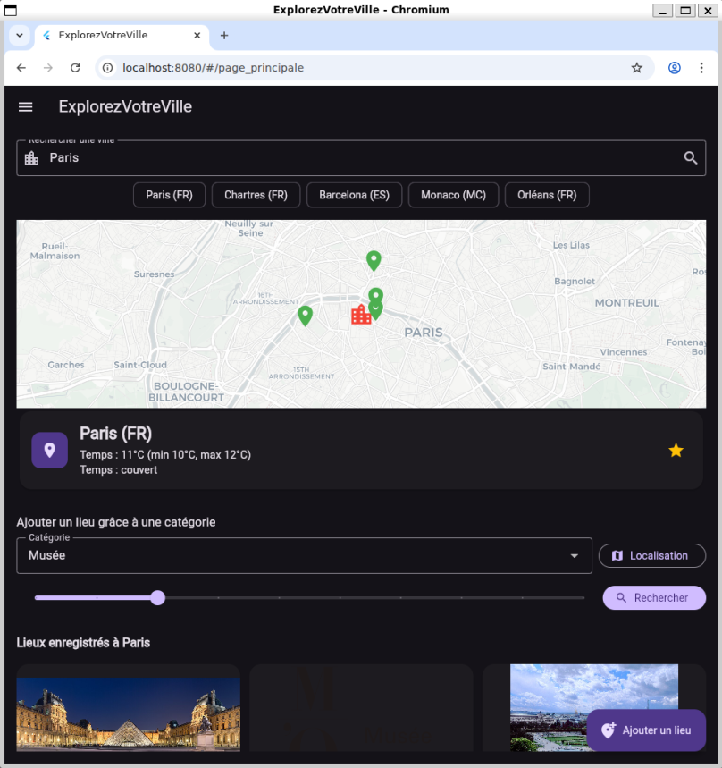
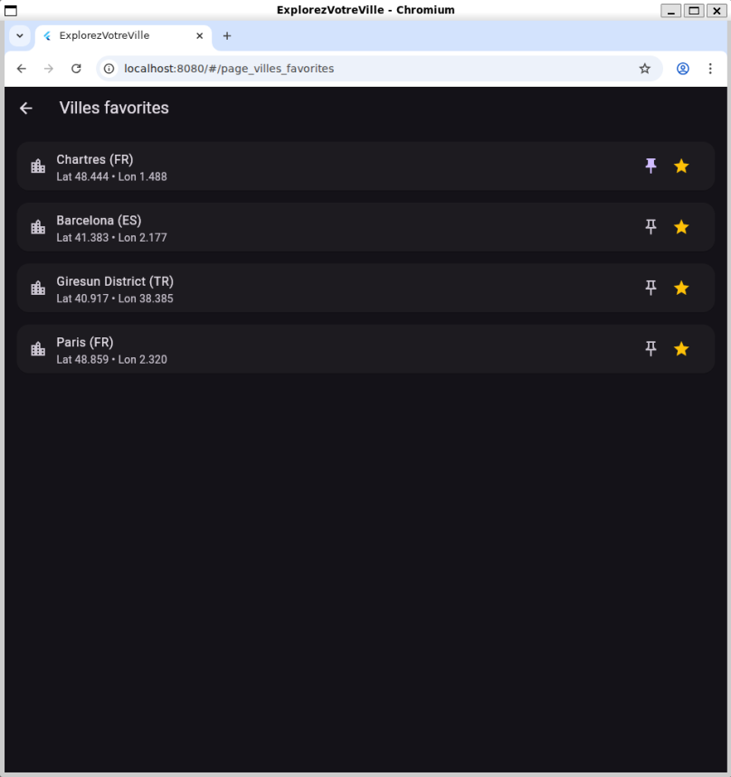

# **Projet Flutter**

## Structure du projet

### ***Partie UI***

* *lib/pages/*

Les différentes pages de l'application.
Gère l'affichage des widgets et intéractions locales (animations, formulaire)

* *lib/main.drt*

Configuration des routes et du thème. Le `MaterialApp` définit les routes nommées et injecte les dépendances globales via `MultiProvider`

### ***Gestion d'État***

* *lib/providers/*

    - Utilisation du pattern `ChangeNotifier`
    - Utilisation de `LieuProvider` qui appelle la couche de données pour sauvegarder, met à jour sa liste locale (`_cache`), puis notifie l'UI (`notifyListeners()`) pour qu'elle se rafraîchisse.

### ***Modèle***

* *lib/models/*

Contient les classes comme `Lieu`

### ***Gestion Donnée***

* *lib/db/app_database.dart*

Initialise la connexion SQLite, gère la création des tables (lieux, commentaires) et la compatibilité multi-plateforme (Web, Desktop, Mobile).

### ***Gestion Services***

* *lib/services/*

Services API gère la géolocalisation avec `Map_api` et le géocodage avec API Nominatim.

`OverpassApi` & `WikimediaApi` : responsables de faire les requêtes HTTP pour récupérer respectivement les points d'intérêts alentours et les images

## Choix technique

### ***API & Services***

1. Recherche de villes & météo
API : OpenWeatherMap (Geocoding + Weather API)

    - OpenWeatherMap permet :

    - la recherche de villes (géocodage),

    - la récupération de la météo actuelle.

    - Pourquoi OpenWeatherMap ?

    - API gratuite avec un bon quota

    - Données météo fiables

    - Une seule API pour coordonnées + météo

    - Documentation claire

    - Clé API gratuite suffisante

        Exemple d’appel (géocodage)
        `final url = Uri.parse(
        'https://api.openweathermap.org/geo/1.0/direct?q=$query&limit=5&appid=$apiKey',
        );`

2. Géocodage d’adresses
API : Nominatim (OpenStreetMap)

    Utilisée pour :

    * trouver des coordonnées à partir d'une adresse,

    * interpréter un nom de lieu,

    * obtenir une adresse complète (display_name).

        Elle exige l’ajout d’un User-Agent personnalisé.

    Pourquoi Nominatim ?

    * 100 % gratuit

    * Pas de clé API

    * Basé sur OpenStreetMap (open data)

    * Très bon pour rechercher des lieux connus ou approximatifs

        Exemple d’appel
        `final url = Uri.parse(
        'https://nominatim.openstreetmap.org/search'
        '?q=${Uri.encodeComponent(query)}'
        '&format=json&limit=1',
        );`

3. Recherche automatique d’images
API : Wikimedia / Wikipedia

    Si un lieu est ajouté sans image, l’app tente :

    * de trouver une page Wikipédia correspondant au lieu,

    * d’en extraire la miniature.

    Pourquoi Wikimedia ?

    * Gratuit, pas de clé API

    * Idéal pour les monuments, musées, places, etc.

    * Images libres selon licence Wikimedia

        Exemple (recherche d’une page)
        `final searchUrl = Uri.parse(
        'https://fr.wikipedia.org/w/api.php'
        '?action=query&list=search&format=json'
        '&srsearch=${Uri.encodeComponent(titre)}'
        '&srlimit=1'
        );`

4. Localisation de l’utilisateur
Package : Geolocator

    Permet de :

    * demander la permission GPS,

    * récupérer la position de l’utilisateur,

    * centrer la carte automatiquement.

    Pourquoi Geolocator ?

    * Facile à intégrer

    * Gère toutes les permissions

    * Compatible Android & iOS

    `Position position = await Geolocator.getCurrentPosition();`

### ***Provider***

1. Simplicité et Lisibilité : 

    Utilisation du pattern "Observer" car simple à comprendre. Lorsqu'une donnée change (ex: `_cache mis à jour`), la méthode `notifyListeners()` est appelée manuellement pour reconstruire l'interface.

2. Séparation UI / Logique : 

    La PagePrincipale ne sait pas comment les lieux sont sauvegardés, elle sait juste qu'elle doit afficher la liste fournie par le `LieuxProvider`.

3. Mécanisme de Cache intégré : 

    Pour le `LieuxProvider` on utilise une `Map<String, List<Lieu>> _cache`. Cela évite de rappeler la base de données à chaque rafraîchissement de l'écran.

### ***modèle de données SQLite***

1. Intégrité des Données : 

    L'utilisation de PRAGMA `foreign_keys = ON` qui nous évite d'avoir un `commentaires` qui n'a pas de `lieu` associé si un `lieu` est supprimé (grâce au `ON DELETE CASCADE` défini dans `app_database.dart`).

2. Compatibilité : 

    On gère explicitement Windows, Linux et macOS via `sqfliteFfiInit()`, rendant l'application solide sur desktop/ordinateur .

## Capture d'Écran

